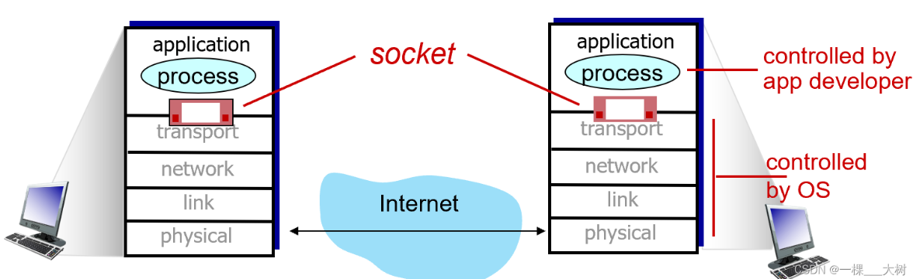
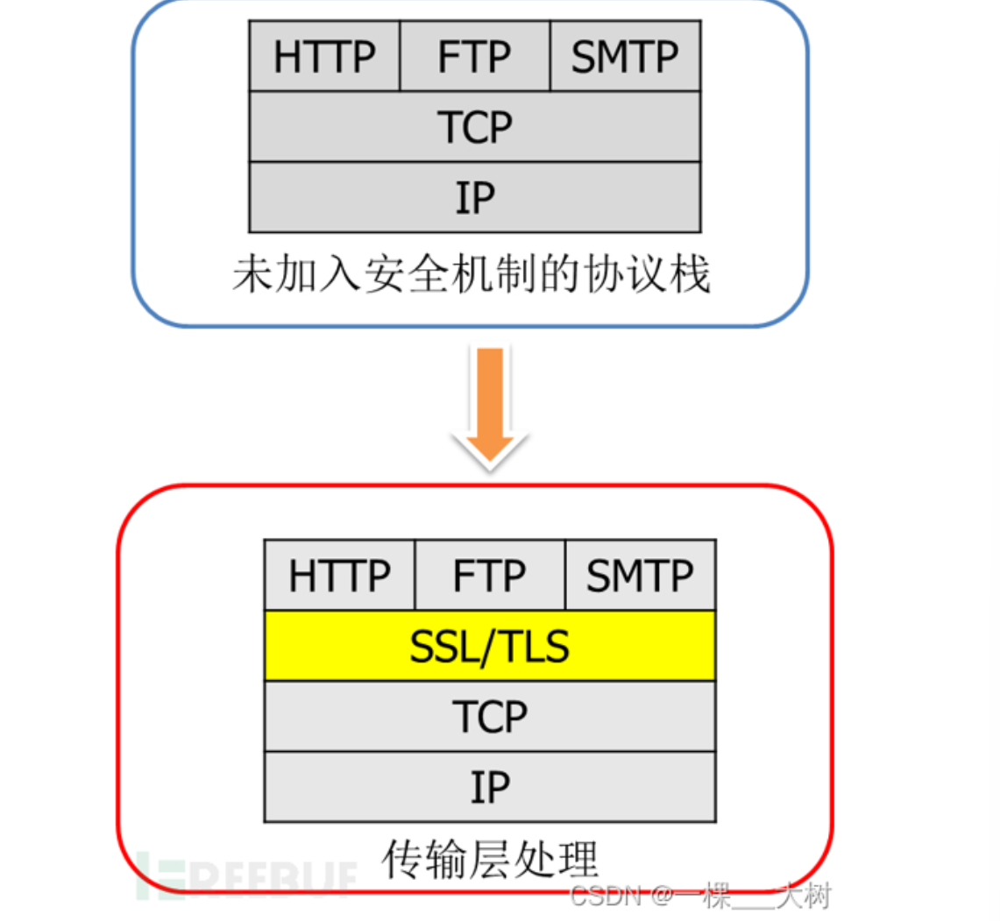
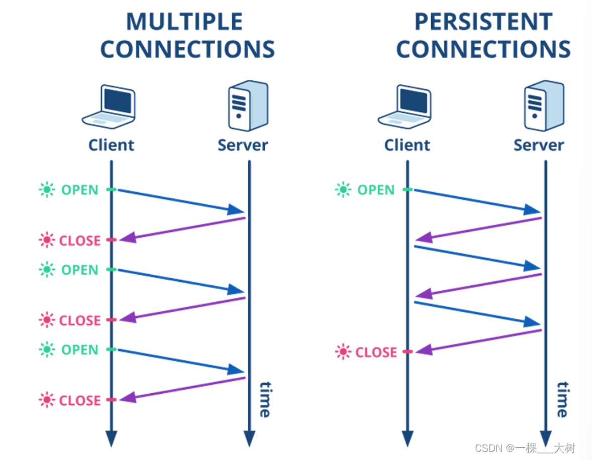

# 应用层

## 概述
1. Client-server architecture
   * Server
       总是在线（always on host）；
       永久的IP地址（permanent IP address）；
       配置在数据中心（often in data centers）；
   * Client
       与服务器沟通联系；
       被间歇性（intermittently）的连接；
       拥有动态地址；
       客户之间不直接联系；

2. Peer-peer architecture
    没有一直在线的服务器；
    端与端之间直接进行连接；
    自拓展性（self-scalability），每个对等方通过向其他对等方分发文件为系统提供服务能力；
    对等方可间歇性的被连接并且可以改变IP地址；

3. 进程通过一个称为套接字（Sockets）的软件接口向网络发送报文和从网络接受报文。由于该套接字是建立网络应用的可编程接口，因此套接字被称为应用程序和网络之间的应用程序编程接口（Application Programming Interface，API）。

4. TCP服务
面向连接的服务（connection-oriented）：报文开始流动之前，TCP让客户和服务器互相交换运输层控制信息（握手阶段），握手阶段后，一条TCP连接（TCP connection）就在两条进程的套接字之间建立；
可靠的数据传送服务（reliable transport）：无差别、按适当顺序交付所有发送的数据；
拥塞控制机制（congestion control）；
TCP安全：
安全套接字层（Secure Sockets Layer，SSL） 提供了关键的进程到进程的安全性服务。

5. UDP服务
提供一种不可靠数据传送服务（unreliable data transfer）；
当进程将报文发送至UDP套接字时，UDP并不能保证该报文将到达接收进程；

## HTTP
1. 概述
   1. Web的应用层协议是超文本传输协议（HyperText Transfer Protocol，HTTP），它是Web的核心。。

   2. Web页面（Web page）（也叫文档）是由对象组成。一个对象（object）只是一个文件，诸如一个HTML文件、一个JPEG图片、一个Java小程序等等；
   3. 多数Web页面包含HTML基本文件（base HTML） 以及几个引用对象；
   4. Web浏览器（Web browser） 实现了HTTP的客户端；Web服务器（Web server） 实现了HTTP的服务器端；
   5. HTTP使用TCP作为它的支撑运输协议；
   6. 因为HTTP服务器并不保存关于客户的任何信息，所以我们会说HTTP是一个无状态协议（stateless protocol）；
2. 可持续连接和非持续连接
   1. 非持续连接
        TCP连接开启；
        最多一个对象通过该TCP连接发送；
        该TCP连接关闭；
    2. 持续连接
        TCP连接开启；
        多个对象通过该TCP连接发送；
        该TCP连接关闭；

3. 报文格式
